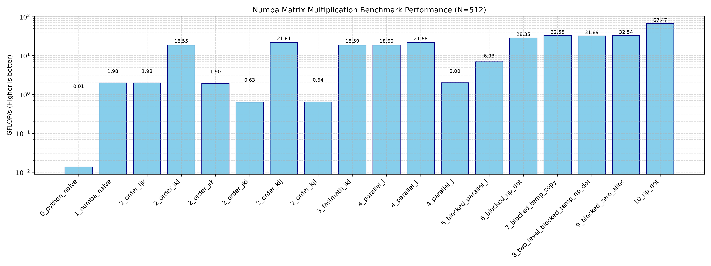

# Matrix Multiplication example

This tutorial has two parts: the first part is code optimization where
techniques to optimize the matrix
multiplication code are discussed, and the second part discusses how
those techniques are automated by
using the `swiftpack` decorator.

## Code optimization

The optimization story behind `benchmarks/matmul_numba_bench.py` is a
classic GEMM workflow: start with a
slow reference kernel, then progressively improve locality, backend
compilation, and parallelism until the
execution pattern matches the hardware more closely.

### 0- naive baseline

The simplest implementation is the direct triple loop:

```python
def matmul_python_0(A, B, C):
    n = A.shape[0]
    for i in range(n):
        for j in range(n):
            C[i, j] = 0.0
            for k in range(n):
                C[i, j] += A[i, k] * B[k, j]
```

This version is easy to verify and matches the mathematical definition,
but it is dominated by Python-level
loop overhead and poor memory access patterns. Each iteration performs
Python object dispatch and repeated
scalar updates, so it is orders of magnitude slower than optimized
numerical kernels.

This baseline is useful because it establishes the reference behavior:
the result is correct, but the
implementation is far from efficient.

### 1- numba optimized

The first major improvement is to move the inner computation into Numba
JIT code:

```python
@njit
def matmul_numba_1(A, B, C):
    n = A.shape[0]
    for i in range(n):
        for j in range(n):
            C[i, j] = 0.0
            for k in range(n):
                C[i, j] += A[i, k] * B[k, j]
```

Numba compiles the loop nest to machine code, eliminating much of the
Python overhead. The algorithm is still
the same, but the kernel now runs efficiently on the CPU. This is the
point at which we see a large jump in
throughput without changing the mathematical structure.

### 2- loop exchange

The next optimization is loop reordering. The naive kernel uses
`i, j, k` order; the benchmark also compares
other permutations such as `i, k, j` and `j, i, k`.

```python
@njit
def matmul_2_ikj(A, B, C):
    n = A.shape[0]
    C.fill(0.0)
    for i in range(n):
        for k in range(n):
            for j in range(n):
                C[i, j] += A[i, k] * B[k, j]
```

The benefit comes from locality and reuse. With the `i, k, j` order, the
code keeps a row of `A` and updates
multiple `C[i, j]` entries as `k` changes, while `B[k, j]` is streamed
in a way that better matches cache usage.
This reduces the penalty from poor memory locality and often improves
the compiled kernel substantially.

As a general rule, loop order matters because the innermost loop
determines the stride pattern of memory
access. Reordering loops is often the simplest way to improve a
cache-friendly GEMM kernel.

### 3- compiler flags

Once the loop nest is structurally good, the next step is to let the
backend aggressively optimize it:

```python
@njit(fastmath=True)
def matmul_opt_flags_3(A, B, C):
    n = A.shape[0]
    C.fill(0.0)
    for i in range(n):
        for k in range(n):
            for j in range(n):
                C[i, j] += A[i, k] * B[k, j]
```

`fastmath=True` enables mathematically aggressive optimizations such as
reassociation and vectorization-friendly
transformations. These can increase throughput for floating-point
kernels, especially when the code is
numerically well-behaved and the result tolerances are not overly
strict.

This optimization does not change the algorithm; it changes how the
compiler is allowed to transform the kernel.
It is a pure backend optimization, not a rewrite of the matrix formula.

### 4- parallelism

A high-level parallelism improvement is to parallelize the outer loop
with `prange`:

```python
@njit(parallel=True, fastmath=True)
def matmul_parallel_i_4(A, B, C):
    n = A.shape[0]
    C.fill(0.0)
    for i in prange(n):
        for k in range(n):
            for j in range(n):
                C[i, j] += A[i, k] * B[k, j]
```

This is a safe and effective parallel strategy because different values
of `i` write to disjoint rows of `C`.
Each thread can compute one output row independently, so the work is
naturally parallelized.

The benchmark also compares other parallel choices such as `prange` over
`j` or `k`, but the `i`-parallel form is
especially natural for row-wise matrix multiplication. Parallelization
can give an additional large gain once the
single-threaded implementation is already efficient.

### 5- loop tiling

The final major optimization is loop tiling or blocking. Instead of
processing the entire matrix in one pass, we
work on sub-blocks that fit better into cache:

```python
@njit(parallel=True, fastmath=True)
def matmul_blocked_parallel_5(A, B, C):
    n = A.shape[0]
    bs = BLOCK_SIZE
    C.fill(0.0)

    num_i_blocks = (n + bs - 1) // bs

    for b in prange(num_i_blocks):
        i_block = b * bs
        i_end = min(i_block + bs, n)

        for k_block in range(0, n, bs):
            for j_block in range(0, n, bs):
                k_end = min(k_block + bs, n)
                j_end = min(j_block + bs, n)

                for i in range(i_block, i_end):
                    for k in range(k_block, k_end):
                        for j in range(j_block, j_end):
                            C[i, j] += A[i, k] * B[k, j]
```

The key idea is to split the computation into tiles of size
`BLOCK_SIZE`, so each block of `A`, `B`, and `C`
fits in cache instead of streaming huge sections of the matrices through
memory. This reduces cache misses and
keeps the arithmetic core fed with data more efficiently.

The benchmark also explores blocked variants that use `np.dot` on
submatrices and temporary buffers. These are
closer to a high-performance BLAS-style GEMM and can be even faster when
the tile size is chosen well.

The overall progression is shown 
in  
and can be summarized as:

1. correct but slow Python triple loop,
2. JIT compilation to remove interpreter overhead,
3. loop reordering to improve locality,
4. backend compiler flags for vectorization and reassociation,
5. parallel outer loops with `prange`, and
6. cache-aware tiling to reduce memory traffic.

The table summary is (copied from benchmark output):

| Baseline Implementation           | GFLOP/s    | Abs Speedup  | Rel Speedup  | Correct  |
| :--- | :--- | :--- | :--- | :--- |
| 0_python_naive                    |      0.014 |         1.00x |         1.00x | PASS     |
| 1_numba_naive                     |      2.466 |         2.79x |         2.79x | PASS     |
| 2_order_ijk                       |      2.466 |         2.79x |         1.00x | PASS     |
| 2_order_ikj                       |     20.538 |        23.21x |         8.33x | PASS     |
| 2_order_jik                       |      2.376 |         2.69x |         0.12x | PASS     |
| 2_order_jki                       |      0.590 |         0.67x |         0.25x | PASS     |
| 2_order_kij                       |     19.316 |        21.83x |        32.74x | PASS     |
| 2_order_kji                       |      0.597 |         0.67x |         0.03x | PASS     |
| 3_fastmath_ikj                    |     20.538 |        23.21x |        34.42x | PASS     |
| 4_parallel_i                      |     20.546 |        23.22x |         1.00x | PASS     |
| 4_parallel_k                      |     19.024 |        21.50x |         0.93x | PASS     |
| 4_parallel_j                      |      2.581 |         2.92x |         0.14x | PASS     |
| 5_blocked_parallel_i              |      6.945 |         7.85x |         2.69x | PASS     |
| 6_blocked_np_dot                  |     28.775 |        32.52x |         4.14x | PASS     |
| 7_blocked_temp_copy               |     30.491 |        34.46x |         1.06x | PASS     |
| 8_two_level_blocked_temp_np_dot   |     31.485 |        35.59x |         1.03x | PASS     |
| 9_blocked_zero_alloc              |     32.819 |        37.09x |         1.04x | PASS     |
| 10_np_dot                         |     67.542 |        76.34x |         2.06x | PASS     |

Note. numbers are obtained from Intel(R) Core(TM) Ultra 7 265 with 
20 cores and 40 threads, 30MB cache with avx2. 

This progression is the core optimization story behind matrix
multiplication in Numba and is exactly the pattern
that `swiftpack` tries to automate.

## Automation
